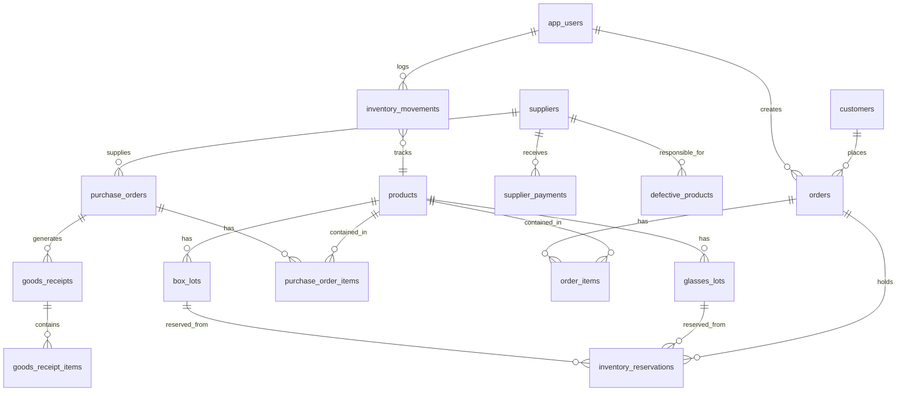
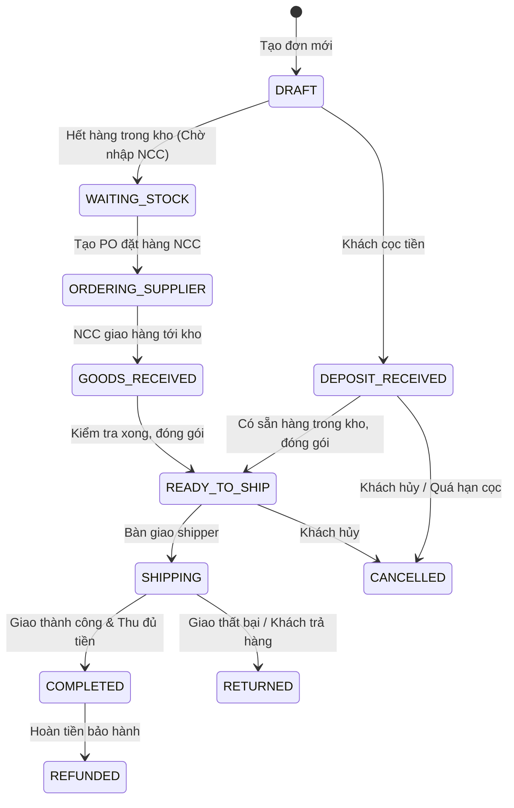

# TÀI LIỆU THIẾT KẾ HỆ THỐNG (SYSTEM DESIGN)
> **Dự án:** ORD Studio — Order & Stock OS  
> **Kiến trúc:** Next.js 14 (App Router) + Supabase PostgreSQL + Realtime Engine  
> **Phiên bản:** 2.0  
> **Ngày cập nhật:** 2026-09-05  

---

## 1. TỔNG QUAN KIẾN TRÚC & CÔNG NGHỆ (TECH STACK & ARCHITECTURE)

```mermaid
graph TB
    subgraph Client Layer
        Web[Web Browser - Single Page UI]
        Mobile[Responsive Mobile Browser]
        RealtimeSub[Supabase Realtime Channel Listener]
    end

    subgraph Application Layer - Next.js App Router
        API_Auth[/api/auth - Login / Register / Sessions]
        API_Data[/api/v2 - Orders / Inbound / Inventory / Users]
        Middleware[Auth Session Guard & HMAC-SHA256 Verifier]
        UI_Dashboard[React 18 Dashboard Component]
    end

    subgraph Service & Engine Layer
        ResEngine[FIFO Reservation Engine]
        LotEngine[Dual Lot Engine - Glasses & Box]
        MovementAudit[Immutable Stock Movement Auditor]
        DefectTracker[QC & Defect Separation Service]
        ConsolidateEngine[Draft PO Consolidation Engine]
    end

    subgraph Data Layer - Supabase PostgreSQL
        Pooler[PgBouncer Transaction Pooler :6543]
        DirectDB[PostgreSQL Core Engine :5432]
        RealtimeSvc[Postgres WAL Replication / Realtime]
    end

    Web --> UI_Dashboard
    Mobile --> UI_Dashboard
    UI_Dashboard --> API_Data
    UI_Dashboard --> API_Auth
    API_Auth --> Middleware
    API_Data --> ResEngine
    API_Data --> LotEngine
    API_Data --> MovementAudit
    API_Data --> DefectTracker
    API_Data --> ConsolidateEngine
    ResEngine --> Pooler
    LotEngine --> Pooler
    MovementAudit --> Pooler
    DefectTracker --> Pooler
    ConsolidateEngine --> Pooler
    Pooler --> DirectDB
    DirectDB --> RealtimeSvc
    RealtimeSvc -.-> RealtimeSub
    RealtimeSub -.-> UI_Dashboard
```

### 1.1. Công nghệ Sử dụng (Technology Stack)
- **Frontend / Fullstack Framework:** Next.js 14 (App Router, Node runtime).
- **Ngôn ngữ:** TypeScript (Strict typing), React 18, React DOM.
- **Styling:** Vanilla CSS Design System (Custom Dark Mode, HSL Color Palette, responsive grid, micro-animations, không dùng thư viện CSS cồng kềnh như Tailwind).
- **Cơ sở dữ liệu:** Supabase PostgreSQL (Singapore Region `ap-southeast-1`).
  - Sử dụng **PgBouncer Transaction Pooler** (Port `6543`) để xử lý hàng ngàn kết nối serverless đồng thời mà không bị cạn kiệt connection pool.
  - Hỗ trợ kết nối Direct PostgreSQL (Port `5432`) khi cần chạy migration hoặc DDL script.
- **Bảo mật & Xác thực:**
  - Password Hashing: Thuật toán `scrypt` với muối ngẫu nhiên 16 bytes.
  - Session Token: Chữ ký HMAC-SHA256, lưu an toàn trong cookie HttpOnly.
- **Đồng bộ thời gian thực:** Supabase Realtime Channels (`postgres_changes` trên bảng `app_settings`).

---

## 2. KIẾN TRÚC DỮ LIỆU & ERD (DATABASE SCHEMA DESIGN)

Hệ thống bao gồm 17 bảng cơ sở dữ liệu có quan hệ chặt chẽ:



### 2.1. Chi tiết các Bảng Dữ liệu Cốt lõi

#### Nhóm Sản phẩm & Lô hàng (Products & Lots)
1. **`products`**: Danh mục sản phẩm gốc.
   - `id`: UUID (Khóa chính).
   - `sku`: Mã sản phẩm (Unique, ví dụ: `RB-3025-GOLD`).
   - `name`: Tên sản phẩm.
   - `kind`: Phân loại (`GLASSES` | `BOX`).
   - `created_at`, `updated_at`.
2. **`glasses_lots`**: Quản lý từng lô nhập của Kính.
   - `id`: UUID.
   - `product_id`: Khóa ngoại trỏ về `products`.
   - `supplier_id`: Khóa ngoại trỏ về `suppliers`.
   - `goods_receipt_id`: Khóa ngoại trỏ về phiếu nhập kho.
   - `unit_cost`: Giá vốn đơn vị của lô này.
   - `received_qty`: Số lượng nhập ban đầu.
   - `remaining_qty`: Số lượng vật lý thực tế còn trong kho.
   - `reserved_qty`: Số lượng đang bị khóa cho các đơn cọc/chờ giao.
   - `received_at`: Thời điểm nhập hàng (dùng để sắp xếp FIFO).
3. **`box_lots`**: Quản lý từng lô nhập của Hộp kính.
   - Các trường tương tự `glasses_lots`.
   - `box_type`: Phân loại hộp (`LOOSE` - Hộp rời tự do | `ATTACHED` - Hộp đi cùng kính).
   - `pending_attached_qty`: Số lượng hộp kèm đang tạm khóa vì kính cùng lô chưa về.

#### Nhóm Mua hàng & Nhập kho (Procurement)
4. **`suppliers`**: Nhà cung cấp.
   - `id`, `name`, `phone`, `contact_channel`, `address`, `notes`.
5. **`purchase_orders`**: Đơn đặt hàng NCC.
   - `id`, `code` (ví dụ: `PO-2026-001`), `supplier_id`, `status` (`DRAFT`, `ORDERED`, `PARTIAL`, `RECEIVED`, `MERGED`, `CANCELLED`).
   - `merged_into_order_id`: Trỏ về đơn cha nếu đơn này bị gộp.
   - `total_amount`: Tổng giá trị tiền hàng.
   - `ship_cost`: Phí vận chuyển NCC tính cho shop.
6. **`purchase_order_items`**: Chi tiết món hàng trong đơn mua.
   - `id`, `purchase_order_id`, `product_id`, `line_type` (`FULL_BOX`, `GLASSES_ONLY`, `LOOSE_BOX`).
   - `source_supplier`: Lưu vết NCC gốc khi bị gom đơn.
   - `quantity`: Số lượng đặt.
   - `unit_cost`: Đơn giá mua dự kiến.
7. **`goods_receipts` & `goods_receipt_items`**: Phiếu nhập kho thực tế.
   - Lưu thời điểm nhập, người nhập, số lượng đạt (`good_qty`), số lượng lỗi (`defective_qty`).
8. **`defective_products`**: Quản lý hàng hỏng/lỗi để khiếu nại.
   - `id`, `product_id`, `supplier_id`, `quantity`, `reason`, `photo_urls`, `status` (`PENDING`, `COMPENSATED`, `DISPOSED`).
9. **`supplier_payments`**: Sổ theo dõi thanh toán cho NCC.
   - `id`, `purchase_order_id`, `supplier_id`, `amount`, `payment_type` (`DEPOSIT`, `PAYMENT`), `paid_at`, `notes`.

#### Nhóm Bán hàng & Giữ hàng (Sales & Reservations)
10. **`customers`**: Khách hàng.
    - `id`, `name`, `phone`, `address`, `channel` (FB, IG, Web, Offline), `total_orders`, `total_spent`.
11. **`orders`**: Đơn bán hàng.
    - `id`, `code` (ví dụ: `SO-2026-001`), `customer_id`, `status` (`DRAFT`, `WAITING_STOCK`, `DEPOSIT_RECEIVED`, `ORDERING_SUPPLIER`, `GOODS_RECEIVED`, `READY_TO_SHIP`, `SHIPPING`, `COMPLETED`, `CANCELLED`, `RETURNED`, `REFUNDED`).
    - `deposit_amount`: Tiền khách đã cọc.
    - `ship_payer`: Người chịu phí ship (`SELLER` | `RECIPIENT`).
    - `ship_cost`: Phí vận chuyển giao hàng cho khách.
    - `notes`: Ghi chú đơn.
12. **`order_items`**: Chi tiết sản phẩm bán.
    - `id`, `order_id`, `glasses_product_id`, `box_product_id`.
    - `line_type`: `GLASSES_WITH_ATTACHED` | `GLASSES_WITH_LOOSE` | `GLASSES_ONLY` | `BOX_ONLY`.
    - `quantity`: Số lượng bán.
    - `selling_price`: Giá bán cho khách.
13. **`inventory_reservations`**: Bảng điều phối giữ hàng.
    - `id`, `order_id`, `order_item_id`, `glasses_lot_id`, `box_lot_id`.
    - `quantity`: Số lượng giữ từ lô đó.
    - `status`: `RESERVED` (Đang giữ) | `CONSUMED` (Đã xuất trừ kho) | `RELEASED` (Đã nhả lại kho).

#### Nhóm Kiểm toán Kho & Quản trị Hệ thống (Audit & System)
14. **`inventory_movements`**: Sổ nhật ký kho bất biến (Append-Only Log).
    - `id`, `product_id`, `lot_id`, `movement_type` (`RECEIPT`, `RESERVATION`, `CONSUMPTION`, `RELEASE`, `ADJUSTMENT`).
    - `physical_delta`: Biến động số lượng tồn vật lý (+ / -).
    - `reserved_delta`: Biến động số lượng giữ (+ / -).
    - `reference_type`: `PURCHASE_ORDER` | `SALES_ORDER` | `MANUAL_ADJUSTMENT`.
    - `reference_id`: Khóa ngoại trỏ về đơn liên quan.
    - `actor_id`: Tài khoản thực hiện hành động.
    - `occurred_at`: Timestamp chính xác.
15. **`app_users`**: Tài khoản người dùng.
    - `id`, `email`, `password_hash`, `salt`, `role` (`ADMIN` | `USER`), `created_at`.
16. **`app_settings`**: Cấu hình toàn hệ thống.
    - `key` (ví dụ: `allow_registration`), `value` (JSON/Boolean), `updated_at`, `updated_by`.

---

## 3. MÁY TRẠNG THÁI & LUỒNG XỬ LÝ DỮ LIỆU (STATE MACHINES)

### 3.1. Luồng Máy Trạng Thái Đơn Bán Hàng (Sales Order State Machine)



### 3.2. Thuật toán Giữ hàng FIFO (FIFO Reservation Algorithm)
Nằm trong hàm `syncOrderReservations(orderId)` tại [db/v2.ts](file:///c:/Users/PC/Downloads/ORD-Studio-full-backup-2026-08-31-4f4d7f7/source-code/db/v2.ts):

```typescript
// Pseudocode Thuật toán FIFO Reservation:
for (const item of orderItems) {
  let remainingNeeded = item.quantity;
  
  // 1. Quét các lô hàng của sản phẩm theo thứ tự ngày nhập tăng dần (Lô cũ nhất lấy trước)
  const availableLots = query(
    `SELECT * FROM lots 
     WHERE product_id = $1 AND (remaining_qty - reserved_qty) > 0 
     ORDER BY received_at ASC FOR UPDATE`,
    [item.productId]
  );
  
  // 2. Phân bổ giữ hàng từng lô cho đến khi đủ số lượng
  for (const lot of availableLots) {
    if (remainingNeeded <= 0) break;
    const canReserveFromThisLot = Math.min(lot.remaining_qty - lot.reserved_qty, remainingNeeded);
    
    // Ghi nhận bản ghi giữ hàng
    insertReservation({
      orderId: order.id,
      itemId: item.id,
      lotId: lot.id,
      quantity: canReserveFromThisLot,
      status: 'RESERVED'
    });
    
    // Khóa tăng reserved_qty trên lô
    updateLotReservedQty(lot.id, +canReserveFromThisLot);
    
    // Ghi sổ nhật ký kho bất biến
    insertMovementLog({
      productId: item.productId,
      lotId: lot.id,
      movementType: 'RESERVATION',
      physicalDelta: 0,
      reservedDelta: +canReserveFromThisLot,
      orderId: order.id
    });
    
    remainingNeeded -= canReserveFromThisLot;
  }
}
```

---

## 4. KIẾN TRÚC BẢO MẬT & PHÂN QUYỀN (SECURITY DESIGN)

### 4.1. Cơ chế Mã Hóa Mật khẩu (scrypt Hashing)
Hệ thống sử dụng module mật mã tích hợp của Node.js (`crypto.scrypt`):
1. Mỗi mật khẩu khi đăng ký được sinh ra một chuỗi muối ngẫu nhiên (salt) độ dài **16 bytes** bằng `crypto.randomBytes(16)`.
2. Hàm băm được tính toán: `scrypt(password, salt, 64)`.
3. Chuỗi băm và muối được lưu độc lập trong bảng `app_users`. Khi đăng nhập, hệ thống lấy salt của user tương ứng để băm lại mật khẩu nhập vào và so sánh an toàn bằng `crypto.timingSafeEqual` để chống tấn công Timing Attack.

### 4.2. Quản lý Phiên làm việc (Session Token & Remember Me)
- Token phiên được tạo dưới dạng chuỗi ngẫu nhiên 32 bytes kèm thời điểm khởi tạo và chữ ký **HMAC-SHA256** với bí mật hệ thống.
- **Tùy chọn "Ghi nhớ đăng nhập" (Remember Me):**
  - **Nếu Bật:** Cookie được thiết lập `maxAge = 30 * 24 * 60 * 60` (30 ngày), cờ `httpOnly = true`, `sameSite = 'lax'`, `secure = process.env.NODE_ENV === 'production'`.
  - **Nếu Tắt:** Cookie không có `maxAge`, trở thành **Session Cookie** (tự động xóa sạch khi người dùng đóng trình duyệt).

### 4.3. Cơ chế Khóa Đăng ký Hai Tầng (Dual-Layer Registration Lock)
- **Tầng 1 (Database & Server API):**
  - Trước khi thực hiện bất kỳ lệnh tạo user nào, API `/api/auth` luôn truy vấn trực tiếp bảng `app_settings` (`WHERE key = 'allow_registration'`).
  - Nếu giá trị là `false` hoặc `0`, request lập tức trả về mã `403 Forbidden` kèm JSON `{ error: 'Registration is closed' }`.
- **Tầng 2 (Realtime Client UI):**
  - Trình duyệt đăng ký lắng nghe sự kiện `postgres_changes` trên bảng `app_settings`.
  - Đồng thời duy trì nhịp polling dự phòng 3 giây.
  - Ngay khi Admin gạt tắt đăng ký trên Dashboard, nút "Đăng ký" trên màn hình đăng nhập của tất cả các máy khác lập tức ẩn khỏi DOM.
